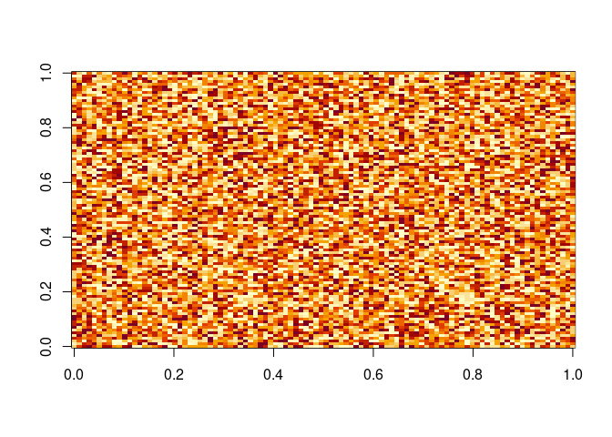
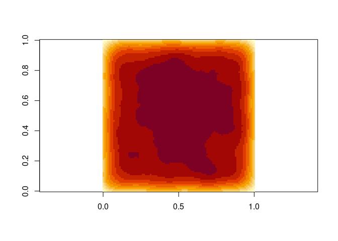

<!-- README.md is generated from README.Rmd. Please edit that file -->

# pfocal 

<!-- badges: start -->

[](http://www.gnu.org/licenses/gpl-3.0)
[](https://www.repostatus.org/#wip)
[](https://github.com/LandSciTech/pfocal/actions)
[](https://codecov.io/gh/LandSciTech/pfocal?branch=master)
<!-- badges: end -->

The goal of `pfocal` is to implement fast parallel convolution. R
version \>= 4.0.0 is required.

## Installation

You can install the package as such:

``` r
# From CRAN
install.packages("devtools")

# Dev version from GitHub
devtools::install_github("LandSciTech/pfocal")
```

## Example

``` r
library(pfocal)

data <- matrix(nrow = 100, ncol = 100, 
               data = runif(n = 100*100, min = 0, max = 10))
image(data, asp = 1)
```



``` r
kernel <- exponential_kernel()
convoluted <- pfocal(data = data, kernel = kernel, edge_value = 0)
image(convoluted, asp = 1)
```


