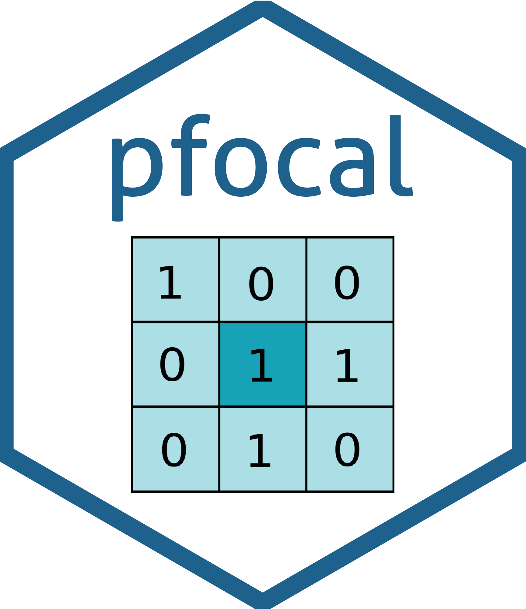

<!-- README.md is generated from README.Rmd. Please edit that file -->

# dwsR 

<!-- badges: start -->

[](http://www.gnu.org/licenses/gpl-3.0)
[](https://www.repostatus.org/#wip)
[](https://github.com/LandSciTech/dwsR/actions)
<!-- badges: end -->

The goal of `dwsR` is to implement fast parallel convolution. R version
&gt;= 3.5 is required.

## Installation

You can install the development version from
[GitHub](https://github.com/) with:

``` r
# install.packages("devtools")
devtools::install_github("LandSciTech/dwsR")
```

## Examples

``` r
data <- matrix(nrow = 10, ncol = 10, data = runif(10*10))
kernel <- matrix(1/9, nrow=3, ncol=3)

pFocal(data = data, kernel = kernel)
```
